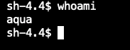

## General 

This guide explains how to deploy and use the Aqua Security Operator to manage Aqua's deployments in an OpenShift 4.x environment. You can use the Operator to deploy Aqua Enterprise or any of its components -
* Server (aka “console”)
* Database (optional; you can map an external database as well) 
* Gateway 
* Enforcer
* Scanner
* KubeEnforcer

Use the Aqua Operator to: 
* Easily deploy Aqua Enterprise on OpenShift
* Manage and scale up Aqua security components with additional replicas
* Assign metadata tags to Aqua Enterprise components
* Easily add and delete Aqua components like Scanner daemons, Kube-Enforcers and Enforcers
	
You can find all Aqua's Operator CRs and their properties at [Custom Resources](../config/crd/bases), 
 [Properties](../config/samples).
	   
## Prerequisites 

Make sure you have a license and access to the Aqua registry. To obtain a license, please contact Aqua Security at https://www.aquasec.com/about-us/contact-us/.

It is advised that you read about the [Aqua Environment and Configuration](https://docs.aquasec.com/docs/purpose-of-this-section) and [Aqua's sizing guide](https://docs.aquasec.com/docs/sizing-guide) before deploying and using the Operator. 

## Types of Aqua Operator
Aqua Security maintains three types of Operators:
* **Marketplace** - The marketplace operator is purchased through Red Hat Marketplace.
* **Community** - Aqua's official Operator. It typically represents the latest and newest version of the Operator. 
* **Certified** - Aqua's official Operator vetted and certified by RedHat. The certified Operator is based on the latest community Operator. It is packaged in a mode that allows it to work in disconnected networks, and contains UBI images as part of the package.  

## Deploying the Aqua Operator
1. Create a new namespace/project called "aqua" for the Aqua deployment.

2. Install the Aqua Operator from Red Hat's OperatorHub and add it to the "aqua" namespace. 

3. Create a secret for the database password
```
oc create secret generic aqua-database-password --from-literal=db-password=<password> -n aqua
```

4. To work with the community Operator, you need to create a registry secret to Aqua's images registry. Aqua's registry credentials are identical to the username and password for Aqua's support portal (https://success.aquasec.com.) -
```bash
oc create secret docker-registry aqua-registry --docker-server=registry.aquasec.com --docker-username=<AQUA_USERNAME> --docker-password=<AQUA_PASSWORD> --docker-email=<user email> -n aqua
```


## Deploying Aqua Enterprise using Custom Resources
The Aqua Operator includes a few CRDs to allow you to deploy Aqua in different configurations. Before you create your deployment CR, please review commons CR examples in the section *CR Examples* below.


**[AquaCSP CRD](../config/crd/bases/operator.aquasec.com_aquacsps.yaml)** provides the fastest methods to deploy Aqua Enterprise in a single cluster. AquaCSP defines how to deploy the Server, Gateway, Aqua Enforcer, and KubeEnforcer in the target cluster. Please see the [example CR](../config/samples/operator_v1alpha1_aquacsp.yaml) for the listing of all fields and configurations.
* You can set the enforcement mode using the ```.spec.enforcer.enforceMode``` property in the CR file.
* You can deploy a Route by setting the  ```.spec.route``` property to "true".
* The default service type for the Console and Gateway is ClusterIP. You can change the service type in the CR.
* You can choose to deploy a different version of Aqua CSP by setting the ```.spec.infra.version```  property or change the image ```.spec.<<server/gateway/database>>.image.tag```.
* You can choose to use an external database by providing the ```.spec.externalDB```  property details.
* You can omit the Enforcer and KubeEnforcer components by removing them from the CR.
* You can add server/gateway environment variables with ```.spec.<<serverEnvs/gatewayEnvs>>``` (same convention of name value as k8s deployment).
* You can add server configmap variables with ```.spec.serverConfigMapData``` (same convention of name value as k8s deployment).
* You can define the server/gateway resources requests/limits with ```.spec.<<server/gateway>>.resources```
* You can define the server/gateway nodeSelector with
   ```.spec.<<server/gateway>>.nodeSelector```
* You can define the server/gateway affinity with
   ```.spec.<<server/gateway>>.affinity```
* You can define the server/gateway toleration with
   ```.spec.<<server/gateway>>.tolerations```

The **[AquaServer CRD](../config/crd/bases/operator.aquasec.com_aquaservers.yaml)**, **[AquaDatabase CRD](../config/samples/operator_v1alpha1_aquadatabase.yaml)**, and **[AquaGateway CRD](../config/samples/operator_v1alpha1_aquagateway.yaml)** are used for advanced configurations where the server components are deployed across multiple clusters.

**[AquaEnforcer CRD](../config/samples/operator_v1alpha1_aquaenforcer.yaml)** is used to deploy the Aqua Enforcer in any cluster. Please see the [example CR](../config/samples/operator_v1alpha1_aquaenforcer.yaml) for the listing of all fields and configurations.
* You need to provide a token to identify the Aqua Enforcer.
* You can set the target Gateway using the ```.spec.gateway.host```and ```.spec.gateway.port``` properties.
* You can choose to deploy a different version of the Aqua Enforcer by setting the ```.spec.deploy.image.tag``` property. 
    If you choose to run old/custom Aqua Enforcer version, you must set ```.spec.common.allowAnyVersion``` .
* You can add environment variables using ```.spec.env```.
* You can define the enforcer resources requests/limits using ```.spec.deploy.resources```.
* You can define the enforcer nodeSelector with
  ```.spec.deploy.nodeSelector```
* You can define the enforcer affinity with
  ```.spec.deploy.affinity```
* You can define the enforcer toleration with
  ```.spec.deploy.tolerations```

**[AquaKubeEnforcer CRD](../config/crd/bases/operator.aquasec.com_aquakubeenforcers.yaml)** is used to deploy the KubeEnforcer in your target cluster. Please see the [example CR](../config/samples/operator_v1alpha1_aquakubeenforcer.yaml) for the listing of all fields and configurations.
* You need to provide a token to identify the KubeEnforcer to the Aqua Server.
* You can set the target Gateway using the ```.spec.config.gateway_address```  property.
* You can choose to deploy a different version of the KubeEnforcer by setting the ```.spec.deploy.image.tag``` property.
    If you choose to run old/custom Aqua KubeEnforcer version, you must set ```.spec.allowAnyVersion``` .
* You can add environment variables using ```.spec.env```.
* You can define the kube-enforcer resources requests/limits using ```.spec.deploy.resources```.
* You can define the kube-enforcer nodeSelector with
  ```.spec.deploy.nodeSelector```
* You can define the kube-enforcer affinity with
  ```.spec.deploy.affinity```
* You can define the kube-enforcer toleration with
  ```.spec.deploy.tolerations```

**[AquaStarboard CRD](../config/crd/bases/aquasecurity.github.io_aquastarboards.yaml)** is used to deploy the AquaStarboard in your target cluster by kube-enforcer.

**[ClusterConfigAuditReports CRD](../config/crd/bases/aquasecurity.github.io_clusterconfigauditreports.yaml)** is used to deploy the ClusterConfigAuditReports in your target cluster by starboard.

**[ConfigAuditReports CRD](../config/crd/bases/aquasecurity.github.io_configauditreports.yaml)** is used to deploy the ConfigAuditReports in your target cluster by starboard.

**[AquaScanner CRD](../config/crd/bases/operator.aquasec.com_aquascanners.yaml)** is used to deploy the Aqua Scanner in any cluster. Please see the [example CR](../config/samples/operator_v1alpha1_aquascanner.yaml) for the listing of all fields and configurations.
* You need to set the target Aqua Server using the ```.spec.login.host```  property.
* You need to provide the ```.spec.login.username``` and ```.spec.login.password``` to authenticate with the Aqua Server.
* You can set ``.spec.login.tlsNoVerify`` if you connect scanner to HTTPS server, and don't want to use mTLS verification.  
* You can choose to deploy a different version of the Aqua Scanner by setting the ```.spec.image.tag``` property.
    If you choose to run old/custom Aqua Scanner version, you must set ```.spec.common.allowAnyVersion``` .
* You can define the scanner resources requests/limits using ```.spec.deploy.resources```.
* You can define the scanner nodeSelector with
  ```.spec.deploy.nodeSelector```
* You can define the scanner affinity with
  ```.spec.deploy.affinity```
* You can define the scanner toleration with
  ```.spec.deploy.tolerations```  

## Advanced Configuration ##
### Configuring mTLS

The mTLS will be enabled automatically if the following secretes are available in the namespace:

* aqua-grpc-web
* aqua-grpc-gateway
* aqua-grpc-enforcer
* aqua-grpc-kube-enforcer
    

1. Generate TLS certificates signed by a public CA or Self-Signed CA for server and gateway

   ```shell
   # Self-Signed Root CA (Optional)
   #############################################################################################################
   # Create Root Key
   # If you want a non password protected key just remove the -des3 option
   openssl genrsa -des3 -out rootCA.key 4096
   # Create and self sign the Root Certificate
   openssl req -x509 -new -nodes -key rootCA.key -sha256 -days 1024 -out rootCA.crt
   #############################################################################################################
   # Generate Aqua component certificates
   #############################################################################################################
   
   # Create keys (You can skip this step if you have already created a CSR file for the different components)
   openssl genrsa -out aqua_web.key 2048
   openssl genrsa -out aqua_gateway.key 2048
   openssl genrsa -out aqua_enforcer.key 2048
   openssl genrsa -out aqua_kube-enforcer.key 2048   
   # Create config files
   ## Create the aqua-web SSL config file   
   cat >aqua-web.conf <<EOF
   [ req ]default_bits = 2048
   distinguished_name = req_distinguished_name
   req_extensions = req_ext
   prompt = no
   [ req_distinguished_name ]
   countryName = Country Name (2 letter code)
   stateOrProvinceName = State or Province Name (full name)
   localityName = Locality Name (e.g., city)
   organizationName = Organization Name (e.g., company)
   commonName = Common Name (e.g., server FQDN or YOUR name)
   [ req_ext ]
   subjectAltName = @alt_names
   [alt_names]
   DNS.1 = <console host public DNS>
   DNS.2 = <console service DNS e.g. aqua-web>
   IP.1 = <console service IP e.g. 10.X.X.X>
   EOF   
   ## Create the Aqua Gateway SSL config file   
   cat >aqua-gateway.conf <<EOF
   [ req ]default_bits = 2048
   distinguished_name = req_distinguished_name
   req_extensions = req_ext
   prompt = no
   [ req_distinguished_name ]
   countryName = Country Name (2 letter code)
   stateOrProvinceName = State or Province Name (full name)
   localityName = Locality Name (e.g., city)
   organizationName = Organization Name (e.g., company)
   commonName = Common Name (e.g., server FQDN or YOUR name)
   [ req_ext ]
   subjectAltName = @alt_names
   [alt_names]
   DNS.1 = <gateway public DNS>
   DNS.2 = <gateway service DNS e.g. aqua-gateway>
   EOF   
   # Generate signings (csr)
   ## Generate a CSR file for aqua_web csr   
   openssl req -new -sha256 -key aqua_web.key -config aqua-web.conf \
     -out aqua_web.csr   
   ## Generate a CSR file for aqua_gateway csr   
   openssl req -new -sha256 -key aqua_gateway.key -config aqua-gateway.conf \
     -out aqua_gateway.csr   
   ## Create the Aqua Enforcer csr   
   openssl req -new -sha256 -key aqua_enforcer.key \
     -subj "/C=US/ST=MA/O=aqua/CN=aqua-agent" \
     -out aqua_enforcer.csr   
   ## Create the Aqua Kube Enforcer csr    
   openssl req -new -sha256 -key aqua_kube-enforcer.key \
     -subj "/C=US/ST=MA/O=aqua/CN=aqua-kube-enforcer" \
     -out aqua_kube-enforcer.csr      
   # Generate the certificates
   ## Generate aqua web certificate using the CSR along with appropriate private keys and get it signed by the CA root key      
   openssl x509 -req -in aqua_web.csr -CA rootCA.crt\
     -CAkey rootCA.key -CAcreateserial \
     -out aqua_web.crt -days 500 -sha256 \
     -extensions req_ext -extfile aqua-web.conf      
   ## Generate aqua gateway certificate using the CSR along with appropriate private keys and get it signed by the CA root key   
   openssl x509 -req -in aqua_gateway.csr -CA rootCA.crt -CAkey rootCA.key \
     -CAcreateserial -out aqua_gateway.crt -days 500 \
     -sha256 -extensions req_ext -extfile aqua-gateway.conf   
   ## Generate aqua enforcer certificate using the CSR along with appropriate private keys and get it signed by the CA root key  
   openssl x509 -req -in aqua_enforcer.csr -CA rootCA.crt \
     -CAkey rootCA.key -CAcreateserial -out aqua_enforcer.crt \
     -days 500 -sha256   
   ## Generate aqua kube enforcer certificate using the CSR along with appropriate private keys and get it signed by the CA root key     
   openssl x509 -req -in aqua_kube-enforcer.csr -CA rootCA.crt \
     -CAkey rootCA.key -CAcreateserial -out aqua_kube-enforcer.crt \
     -days 500 -sha256   
   # Verify certificates (optional)   
   openssl x509 -in aqua_web.crt -text -noout  
   openssl x509 -in aqua_gateway.crt -text -noout  
   openssl x509 -in aqua_enforcer.crt -text -noout  
   openssl x509 -in aqua_kube-enforcer.crt -text -noout
   ```

2.  Create secrets for server, gateway, enforcer and kube-enforcer components using the generated SSL certificates.

    ```shell
    # Aqua web:   
    oc create secret generic aqua-grpc-web --from-file=rootCA.crt \
     --from-file=aqua_web.crt --from-file=aqua_web.key -n aqua    
    # Aqua gateway    
    oc create secret generic aqua-grpc-gateway --from-file=rootCA.crt \
     --from-file=aqua_gateway.crt --from-file=aqua_gateway.key -n aqua    
    # Aqua enforcer   
    oc create secret generic aqua-grpc-enforcer --from-file=rootCA.crt \
     --from-file=aqua_enforcer.crt --from-file=aqua_enforcer.key -n aqua    
    # Aqua kube-enforcer    
    oc create secret generic aqua-grpc-kube-enforcer \
     --from-file=rootCA.crt --from-file=aqua_kube-enforcer.crt \
     --from-file=aqua_kube-enforcer.key -n aqua
    ``` 
### Running as unprivileged

1. Create a new SCC (Security Context Constraint):
   
    The aqua-scc yaml defines the cluster’s security context constraints. We strongly recommend not changing anything in this yaml file.
    * Download [aqua-scc](../config/rbac/aqua-scc.yaml) yaml.
    * Apply it by typing:
  ```shell
  oc apply -f aqua-scc.yaml
  ```
  
2. set\create ```.spec.runAsNonRoot``` property with ```true``` value, example:
```yaml
spec:
  runAsNonRoot: true
```
3. To verify it, please run the following command in the relevant pod:
   ```whoami```
   
    Example result:
   
   

### Running as unprivileged - for KubeEnforcer only

1. Create a new SCC (Security Context Constraint):

   The aqua-kube-enforcer-scc yaml defines the cluster’s security context constraints. We strongly recommend not changing anything in this yaml file.
    * Download [aqua-kube-enforcer-scc](../config/rbac/aqua-kube-enforcer-scc.yaml) yaml.
    * In case of custom service account name, rename the value in line 33 from "aqua-kube-enforcer-sa" to your service account.
    * Apply it by typing:
  ```shell
  oc apply -f aqua-kube-enforcer-scc.yaml
  ```

2. set\create ```.spec.runAsNonRoot``` property with ```true``` value, example:
```yaml
spec:
  runAsNonRoot: true
```
3. To verify it, please run the following command in the relevant pod:
   ```whoami```

   Example result:

   


### Assign Pods to Nodes

#### NodeSelector

1. Add a label to a node, with the following command:
   
   ```
   kubectl label nodes <your-node-name> <key>=<value>
   ```
   Example:
   ```
   kubectl label nodes node1 aquadeployments=true
   ```
2. Verify that your chosen node has yours <key>=<value> label:
   
   ```
   kubectl get nodes --selector=<key>=<value>
   ```
   Example:
   ```
   kubectl get nodes --selector=aquadeployments=true
   ```
   Example output:
   ```
   NAME     STATUS   ROLES    AGE   VERSION
   node1    Ready    worker   4d    v1.20.14+0d60930
   ```
3. Set\Create ```.spec.deploy.nodeSelector``` property with ```map[string]string``` value, example:
    ```yaml
    spec:
      nodeSelector:
        key: value
    ```
   example:
    ```yaml
    spec:
      nodeSelector:
        aquadeployments: "true"
    ```
#### Affinity

1. Set\Create ```.spec.deploy.affinity``` property
   example:   
    ```yaml
    spec:
      affinity:
        podAntiAffinity:
          requiredDuringSchedulingIgnoredDuringExecution:
          - labelSelector:
              matchExpressions:
              - key: app
                operator: In
                values:
                - store
            topologyKey: "kubernetes.io/hostname"
    ```
### Toleration

1. add a taint to a node 
2. Set\Create ```.spec.deploy.tolerations``` property
   
   example:
    ```yaml
    spec:
      tolerations:
      - key: "key1"
        operator: "Exists"
        value: "value1"
        effect: "NoSchedule"
   ```
## Operator Upgrades ##
**Major versions** - When switching from an older operator channel to this channel,
the operator will update the Aqua components to this channel Aqua version.

**Minor versions** - For the certified operator, the Aqua operator is using the "Seamless Upgrades" mechanism.
You can set the upgrade approval strategy in the operator subscription to either "Automatic" or "Manual".
If you choose "Automatic", the OLM will automatically upgrade to the latest operator version in this channel
with the latest Aqua components images. If you choose the "Manual" approval strategy, the OLM will
only notify you there is an update available, and will upgrade the operator version and Aqua components
only after a manual approval given.

*If you choose "Manual" approval strategy, we recommend that before approving, make sure you are indeed
upgrading to the most updated version. you can do that by deleting the suggested InstallPlan, once the 
suggested InstallPlan is deleted, the OLM will generate a new InstallPlan to the latest version available
in this channel*

For community operator, you can upgrade minor version by changing the relevant CRs 
```.spec.infra.version``` or ```.spec.<<NAME>>.image.tag```

	
## CR Examples ##

#### Example: Deploying the Aqua Server with an Aqua Enforcer and KubeEnforcer (all in one CR)

```yaml
---
apiVersion: operator.aquasec.com/v1alpha1
kind: AquaCsp
metadata:
  name: aqua
  namespace: aqua
spec:
  infra:                                    
    serviceAccount: "aqua-sa"               
    namespace: "aqua"                       
    version: "6.5"                          
    requirements: true                      
  common:
    imagePullSecret: "aqua-registry"        # Optional: If already created image pull secret then mention in here
    dbDiskSize: 10
    databaseSecret:                         # Optional: If already created database secret then mention in here
      key: "db-password"
      name: "aqua-database-password"      
  database:                                 
    replicas: 1                            
    service: "ClusterIP"
    image:
      registry: "registry.aquasec.com"
      repository: "database"
      tag: "<<IMAGE TAG>>"
      pullPolicy: Always                    
  gateway:                                  
    replicas: 1                             
    service: "ClusterIP"
    image:
      registry: "registry.aquasec.com"
      repository: "gateway"
      tag: "<<IMAGE TAG>>"
      pullPolicy: Always                     
  server:                                   
    replicas: 1                             
    service: "LoadBalancer" 
    image:
      registry: "registry.aquasec.com"
      repository: "console"
      tag: "<<IMAGE TAG>>"
      pullPolicy: Always 
  enforcer:                                 # Optional: If defined, the Operator will create the default Aqua Enforcer 
    enforcerMode: false                     # Defines whether the default Enforcer will work in "Enforce" (true) or "Audit Only" (false) mode
  kubeEnforcer:                             # Optional: If defined, the Operator will create a KubeEnforcer
    registry: "registry.aquasec.com"        
    tag: "<<IMAGE TAG>>" 
  route: true                               # Optional: If defined and set to true, the Operator will create a Route to enable access to the console
  runAsNonRoot: false                       # Optional: If defined and set to true, the Operator will create the pods with unprivileged user.
```

If you haven't used the "route" option in the Aqua CSP CR, you should define a Route manually to enable external access to the Aqua Server (Console).

#### Example: Simple deployment of the Aqua Server 

```yaml
---
apiVersion: operator.aquasec.com/v1alpha1
kind: AquaCsp
metadata:
  name: aqua
  namespace: aqua
spec:
  infra:                                    
    serviceAccount: "aqua-sa"               
    namespace: "aqua"                       
    version: "6.5"                          
    requirements: true                      
  common:
    imagePullSecret: "aqua-registry"        # Optional: If already created image pull secret then mention in here
    dbDiskSize: 10
    databaseSecret:                         # Optional: If already created database secret then mention in here
      key: "db-password"
      name: "aqua-database-password"      
  database:                                 
    replicas: 1                            
    service: "ClusterIP"
    image:
      registry: "registry.aquasec.com"
      repository: "database"
      tag: "<<IMAGE TAG>>"
      pullPolicy: Always                    
  gateway:                                  
    replicas: 1                             
    service: "ClusterIP"
    image:
      registry: "registry.aquasec.com"
      repository: "gateway"
      tag: "<<IMAGE TAG>>"
      pullPolicy: Always                     
  server:                                   
    replicas: 1                             
    service: "LoadBalancer" 
    image:
      registry: "registry.aquasec.com"
      repository: "console"
      tag: "<<IMAGE TAG>>"
      pullPolicy: Always  
  route: true                               # Optional: If defined and set to true, the Operator will create a Route to enable access to the console
  runAsNonRoot: false                       # Optional: If defined and set to true, the Operator will create the pods with unprivileged user.
```

If you haven't used the "route" option in the Aqua CSP CR, you should define a Route manually to enable external access to the Aqua Server (Console).

#### Example: Deploying Aqua Enterprise with split database

"Split database" means there is a separate database for audit-related data: 
```yaml
---
apiVersion: operator.aquasec.com/v1alpha1
kind: AquaCsp
metadata:
  name: aqua
  namespace: aqua
spec:
  infra:                                    
    serviceAccount: "aqua-sa"               
    namespace: "aqua"                       
    version: "6.5"                          
    requirements: true                      
  common:
    imagePullSecret: "aqua-registry"        # Optional: If already created image pull secret then mention in here
    dbDiskSize: 10
    databaseSecret:                         # Optional: If already created database secret then mention in here
      key: "db-password"
      name: "aqua-database-password"
    splitDB: true      
  database:                                 
    replicas: 1                            
    service: "ClusterIP"
    image:
      registry: "registry.aquasec.com"
      repository: "database"
      tag: "<<IMAGE TAG>>"
      pullPolicy: Always                    
  gateway:                                  
    replicas: 1                             
    service: "ClusterIP"
    image:
      registry: "registry.aquasec.com"
      repository: "gateway"
      tag: "<<IMAGE TAG>>"
      pullPolicy: Always                     
  server:                                   
    replicas: 1                             
    service: "LoadBalancer" 
    image:
      registry: "registry.aquasec.com"
      repository: "console"
      tag: "<<IMAGE TAG>>"
      pullPolicy: Always  
  route: true                               # Optional: If defined and set to true, the Operator will create a Route to enable access to the console
  runAsNonRoot: false                       # Optional: If defined and set to true, the Operator will create the pods with unprivileged user.
```

#### Example: Deploying Aqua Enterprise with an external database

```yaml
---
apiVersion: operator.aquasec.com/v1alpha1
kind: AquaCsp
metadata:
  name: aqua
  namespace: aqua
spec:
  infra:                                    
    serviceAccount: "aqua-sa"               
    namespace: "aqua"                       
    version: "6.5"                          
    requirements: true                      
  common:
    imagePullSecret: "aqua-registry"        # Optional: If already created image pull secret then mention in here
    dbDiskSize: 10      
  externalDb:
    host: "<<EXTERNAL DATABASE IP>>"
    port: "<<EXTERNAL DATABASE PORT>>"
    username: "<<EXTERNAL DATABASE USER NAME>>"
    password: "<<EXTERNAL DATABASE PASSWORD>>"    # Optional: you can specify the database password secret in common.databaseSecret                     
  gateway:                                  
    replicas: 1                             
    service: "ClusterIP"
    image:
      registry: "registry.aquasec.com"
      repository: "gateway"
      tag: "<<IMAGE TAG>>"
      pullPolicy: Always                     
  server:                                   
    replicas: 1                             
    service: "LoadBalancer" 
    image:
      registry: "registry.aquasec.com"
      repository: "console"
      tag: "<<IMAGE TAG>>"
      pullPolicy: Always  
  route: true                               # Optional: If defined and set to true, the Operator will create a Route to enable access to the console
  runAsNonRoot: false                       # Optional: If defined and set to true, the Operator will create the pods with unprivileged user.
```

### Example: Deploying Aqua Enterprise with a split external database

```yaml
---
apiVersion: operator.aquasec.com/v1alpha1
kind: AquaCsp
metadata:
  name: aqua
  namespace: aqua
spec:
  infra:                                    
    serviceAccount: "aqua-sa"               
    namespace: "aqua"                       
    version: "6.5"                          
    requirements: true                      
  common:
    imagePullSecret: "aqua-registry"        # Optional: If already created image pull secret then mention in here
    dbDiskSize: 10
    splitDB: true      
  externalDb:
    host: "<<EXTERNAL DATABASE IP>>"
    port: "<<EXTERNAL DATABASE PORT>>"
    username: "<<EXTERNAL DATABASE USER NAME>>"
    password: "<<EXTERNAL DATABASE PASSWORD>>"    # Optional: you can specify the database password secret in common.databaseSecret
  auditDB:
    information:
      host: "<<AUDIT EXTERNAL DB IP>>"
      port: "<<AUDIT EXTERNAL DB PORT>>"
      username: "<<AUDIT EXTERNAL DB USER NAME>>"
      password: "<<AUDIT EXTERNAL DB PASSWORD>>"  # Optional: you can specify the database password secret in auditDB.secret
    secret:                                       # Optional: the secret that hold the audit database password. will create one if not provided
      key: 
      name:                     
  gateway:                                  
    replicas: 1                             
    service: "ClusterIP"
    image:
      registry: "registry.aquasec.com"
      repository: "gateway"
      tag: "<<IMAGE TAG>>"
      pullPolicy: Always                     
  server:                                   
    replicas: 1                             
    service: "LoadBalancer" 
    image:
      registry: "registry.aquasec.com"
      repository: "console"
      tag: "<<IMAGE TAG>>"
      pullPolicy: Always  
  route: true                               # Optional: If defined and set to true, the Operator will create a Route to enable access to the console
  runAsNonRoot: false                       # Optional: If defined and set to true, the Operator will create the pods with unprivileged user.
```

#### Example: Deploying Aqua Enforcer(s)

If you haven't deployed any Aqua Enforcers, or if you want to deploy additional Enforcers, follow the instructions [here](https://github.com/aquasecurity/aqua-operator/blob/master/config/crd/operator_v1alpha1_aquaenforcer.yaml).

This is an example of a simple Enforcer deployment: 
```yaml
---
apiVersion: operator.aquasec.com/v1alpha1
kind: AquaEnforcer
metadata:
  name: aqua
spec:
  infra:                                    
    serviceAccount: "aqua-sa"                
    version: "6.5"                          # Optional: auto generate to latest version
  common:
    imagePullSecret: "aqua-registry"        # Optional: if already created image pull secret then mention in here
  deploy:                                   # Optional: information about Aqua Enforcer deployment
    image:                                  # Optional: take the default value and version from infra.version
      repository: "enforcer"                # Optional: default = enforcer
      registry: "registry.aquasec.com"      # Optional: default = registry.aquasec.com
      tag: "<<IMAGE TAG>>"                  # Optional: default = 5.3
      pullPolicy: "IfNotPresent"            # Optional: default = IfNotPresent
  gateway:                                  # Required: data about the gateway address
    host: aqua-gateway
    port: 8443
  token: "<<your-token>>"                   # Required: The Enforcer group token can use an existing secret instead (you can create a token from the Aqua console)
```

#### Example: Deploying the KubeEnforcer

<h4 style="color:#ff0000">Please note: Starting from operator 2022.4.5 for getting the relevant starboard image, please remove `starboard.infra.version` from the AquaKubeEnforcer yaml or update the yaml like the following Example</h4>

Here is an example of a KubeEnforcer deployment:
```yaml
apiVersion: operator.aquasec.com/v1alpha1
kind: AquaKubeEnforcer
metadata:
  name: aqua
  namespace: aqua
spec:
  infra:
    version: '6.5'
    serviceAccount: aqua-kube-enforcer-sa
  config:
    gateway_address: 'aqua-gateway:8443'          # Required: provide <<AQUA GW IP OR DNS: AQUA GW PORT>>
    cluster_name: Default-cluster-name                     # Required: provide your cluster name
    imagePullSecret: aqua-registry                # Required: provide the imagePullSecret name
  deploy:
    service: ClusterIP
    image:
      registry: registry.aquasec.com
      tag: <<KUBE_ENFORCER_TAG>>
      repository: kube-enforcer
      pullPolicy: Always
  token: <<KUBE_ENFORCER_GROUP_TOKEN>>            # Optional: The KubeEnforcer group token (if not provided manual approval will be required)
  starboard:
    infra:
      serviceAccount: starboard-operator
    config:
      imagePullSecret: starboard-registry
    deploy:
      replicas: 1
```

#### Example: Deploy the Aqua Scanner

You can deploy more Scanners; here is an example:
```yaml
apiVersion: operator.aquasec.com/v1alpha1
kind: AquaScanner
metadata:
  name: aqua
  namespace: aqua
spec:
  infra:
    serviceAccount: aqua-sa
    version: '6.5'
  common:
    imagePullSecret: aqua-registry  
  deploy:
    replicas: 1
    image:
      registry: "registry.aquasec.com"
      repository: "scanner"
      tag: "<<IMAGE TAG>>"
  runAsNonRoot: false                  # Optional: If defined and set to true, the Operator will create the pods with unprivileged user.  
  login:
    username: "<<YOUR AQUA USER NAME>>"
    password: "<<YOUR AQUA USER PASSWORD>>"
    host: 'http://aqua-server:8080'    #Required: provide <<(http:// or https://)Aqua Server IP or DNS: Aqua Server port>>
```